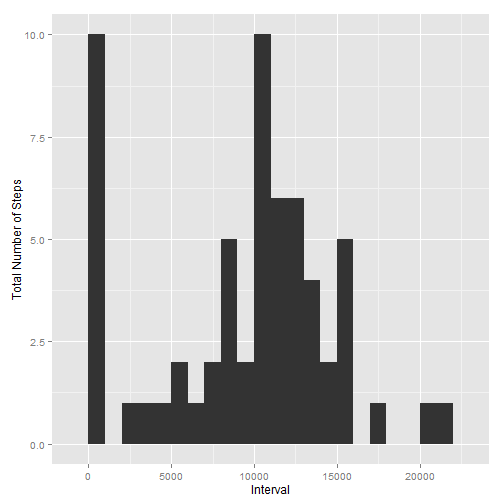
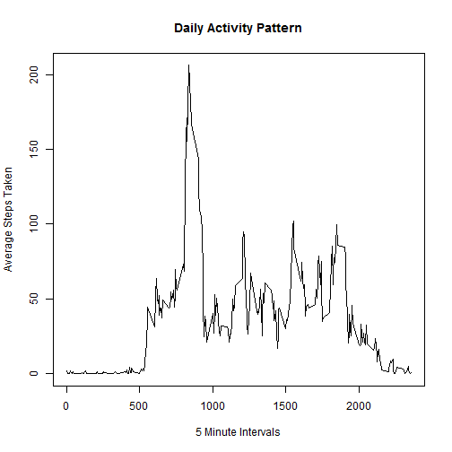
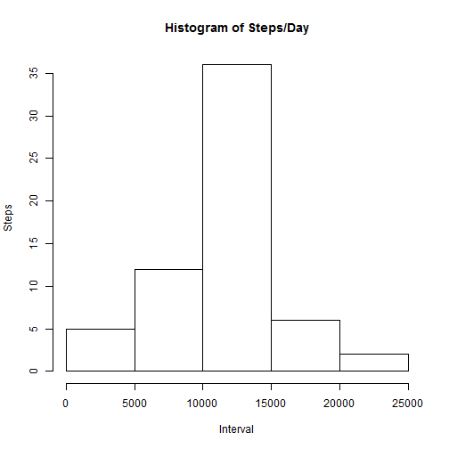

### "PA1_template.Rmd"
#### ---
#### author: "John Akwei"
#### date: "Wednesday, January 14, 2015"
#### output: html_document
#### application: "Reproducible Research: Peer Assessment 1"
#### ---
#### The data analyzed within this document was generated by a
#### personal activity monitoring device, (Fitbit, Nike Fuelband, etc.),
#### from an anonymous individual, collected during the months of
#### October and November 2012, and includes the number of steps taken
#### in 5 minute intervals each day.
#### ---
#### 1)
#### Loading and Preprocessing the Data
#### Required packages

```r
required <- function(wd) {
  setwd(wd)
  if (!require("data.table")) { install.packages("data.table"); require("data.table") }
  if (!require("knitr")) { install.packages("knitr"); require("knitr") }
  if (!require("ggplot2")) { install.packages("ggplot2"); require("ggplot2") }
}
required("C:/Users/johnakwei/Desktop/Coursera/ReproducibleResearch/Week2/RepData_PeerAssessment1")
```

```
## Loading required package: data.table
```

```
## Warning: package 'data.table' was built under R version 3.1.2
```

```
## data.table 1.9.4  For help type: ?data.table
## *** NB: by=.EACHI is now explicit. See README to restore previous behaviour.
## Loading required package: ggplot2
```
#### ---
#### Data download and extraction

```r
unextracted <- "activity.zip"
extracted  <- "activity"
dataLocation <- "http://d396qusza40orc.cloudfront.net/repdata/data/activity.zip"
if (!file.exists(unextracted)) { download.file(dataLocation, unextracted) }
if (!file.exists(extracted)) { unzip(unextracted) }
```
#### ---
#### Preprocessing the data

```r
dataFrame <- read.csv("activity/activity.csv")
```
#### ---
### Analysis of Personal Activity Monitoring Device Data:
#### ---
#### 2)
#### What is the mean total number of steps taken per day?

```r
dataAvg <- tapply(dataFrame$steps, dataFrame$date, FUN=sum, na.rm=T)
qplot(dataAvg, binwidth=1000, xlab="Interval", ylab="Total Number of Steps")
```

 

```r
mean(dataAvg, na.rm=T)
```

```
## [1] 9354.23
```

```r
median(dataAvg, na.rm=T)
```

```
## [1] 10395
```
#### ---
#### 3)
#### What is the average daily activity pattern?

```r
dailyPattern <- aggregate(x=list(steps=dataFrame$steps), by=list(interval=dataFrame$interval), FUN=mean, na.rm=T)
```
#### ---

```r
plot(dailyPattern, type="l", main="Daily Activity Pattern", xlab="5 Minute Intervals", ylab="Average Steps Taken")
```

 

#### ---
#### Which 5-minute interval, on average across all the days in the dataset,
#### contains the maximum number of steps?

```r
dailyPattern[which.max(dailyPattern$steps),]
```

```
##     interval    steps
## 104      835 206.1698
```
#### ---
#### 4)
#### Imputing missing values
#### Total number of missing values in the dataset

```r
naValues <- is.na(dataFrame$steps)
table(naValues)
```

```
## naValues
## FALSE  TRUE 
## 15264  2304
```
#### ---
#### Filled in missing values with 5-minute interval mean values

```r
replaceValues <- function(steps, interval) {
  newValues <- NA
  if (!is.na(steps)) newValues <- c(steps)
  else newValues <- (dailyPattern[dailyPattern$interval==interval, "steps"])
  return(newValues) }
```
#### ---
#### Dataset with missing data filled in

```r
newValuesDF <- dataFrame
newValuesDF$steps <- mapply(replaceValues, newValuesDF$steps, newValuesDF$interval)
```
#### ---
#### Histogram of the total steps/day

```r
dataAvg <- tapply(newValuesDF$steps, newValuesDF$date, FUN=sum)
hist(dataAvg, main="Histogram of Steps/Day", xlab="Interval", ylab="Steps")
```

 

#### ---
#### Mean/Median of the total steps/day

```r
mean(dataAvg)
```

```
## [1] 10766.19
```

```r
median(dataAvg)
```

```
## [1] 10766.19
```
#### ---
#### Question:
#### Do these values differ from estimates from the first part of the assignment?
#### What is the impact of imputing missing data on the estimates of the total
#### daily number of steps?
#### ---
#### Answer:
#### The Mean/Median differs from the beginning estimates.
#### Via creating a dataset with filled missing values, the resulting Mean/Median
#### increased.
#### ---
#### 5)
#### Are there differences in activity patterns between weekdays and weekends?

```r
weekLabels <- function(date) {
  if (weekdays(as.Date(date)) %in% c("Saturday", "Sunday")) { "Weekend"}
  else { "Weekday" } }

newValuesDF$weekLabels <- as.factor(sapply(newValuesDF$date, weekLabels))
```
#### ---
#### Plot of the 5-minute interval, and the average number of steps taken,
#### averaged across all weekdays or weekend days

```r
par(mfrow=c(2,1))
for (type in c("Weekend", "Weekday")) {
intervalAvg <- aggregate(steps~interval, data=newValuesDF,
subset=newValuesDF$weekLabels==type, FUN=mean); plot(intervalAvg, type="l", main=type) }
```

 
